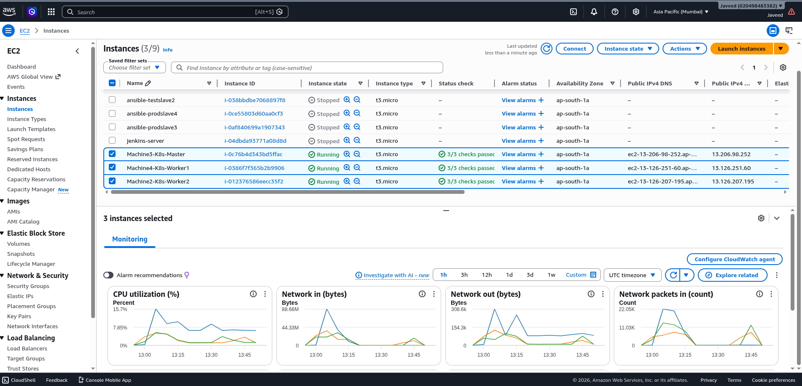
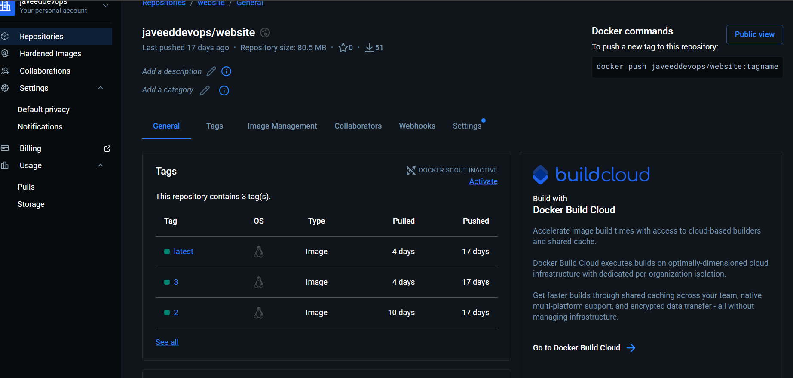
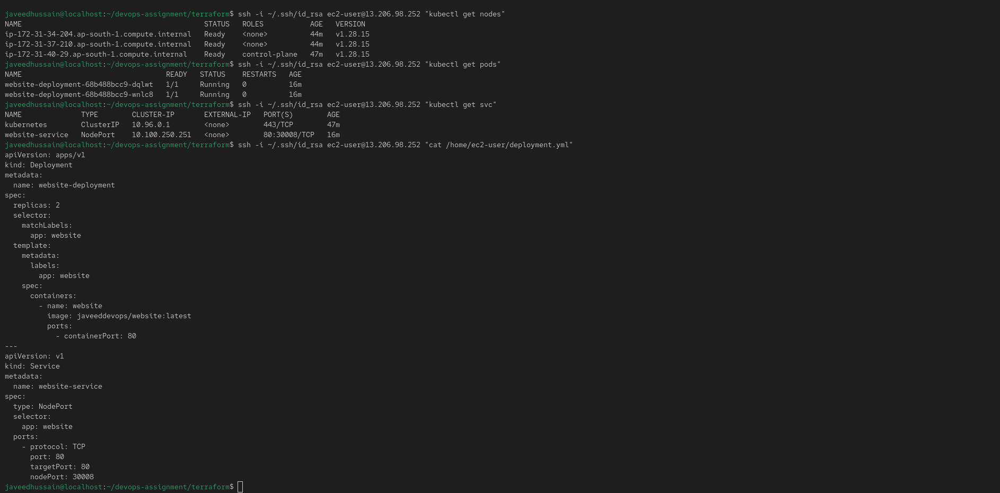
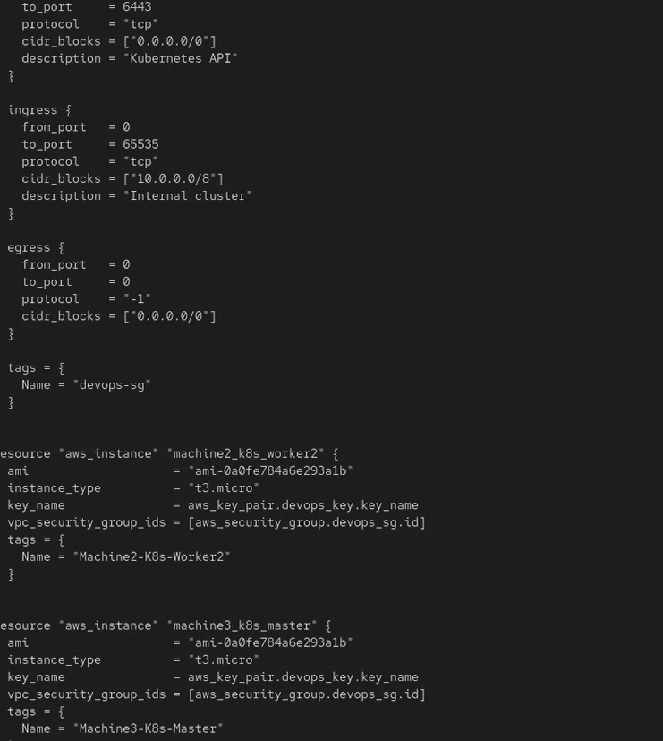
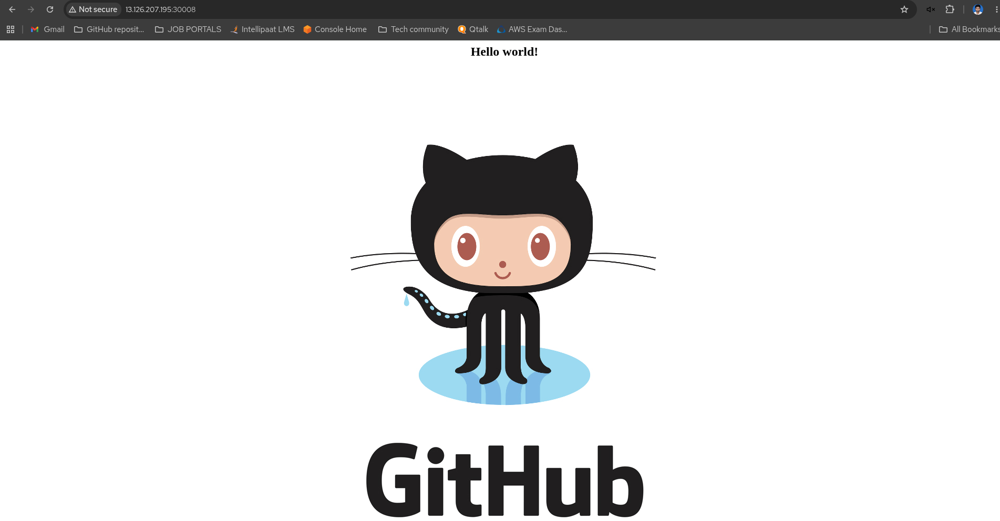

# Kubernetes-Based Container Orchestration with Terraform & Jenkins Pipeline

## Problem Statement
Analytics Pvt Ltd is a product-based company using Docker for containerization.
Due to increasing demand, the organization needs a platform for automating
deployment, scaling, and operations of application containers across clusters of hosts.
The product is available at: https://github.com/hshar/website.git

---

## Architecture Overview

```
GitHub (master branch)
        ↓
  Jenkins Pipeline (Worker1)
        ↓
  Docker Build & Push to DockerHub (Worker2)
        ↓
  Kubernetes Deployment – 2 Replicas (Worker2/3/4)
        ↓
  NodePort Service – Port 30008
```

---

## Infrastructure Architecture

| Machine | Software Installed |
|---------|--------------------|
| Worker1 | Jenkins, Java |
| Worker2 | Docker, Kubernetes |
| Worker3 | Java, Docker, Kubernetes |
| Worker4 | Docker, Kubernetes |

---

## Tools & Technologies Used

- **GitHub** – Source control & Git workflow
- **Jenkins** – CI/CD pipeline automation
- **Docker** – Containerization & DockerHub image registry
- **Kubernetes** – Container orchestration (2 replicas, NodePort 30008)
- **Ansible** – Configuration management across all worker machines
- **Terraform** – Infrastructure provisioning on AWS

---

## 1. Git Workflow

| Branch | Purpose |
|--------|---------|
| `master` | Production-ready code – release on 25th of every month |
| `develop` | Active development & testing |
| `feature/*` | Individual feature branches |

### Workflow
```
feature-branch
      ↓  (pull request)
  develop branch
      ↓  (pull request – merged on 25th of every month)
  master branch
      ↓
  Jenkins pipeline triggered automatically
```

- Releases happen **only on the 25th of every month**
- Jenkins cron trigger configured: `H 0 25 * *`
- Webhook also triggers CodeBuild on every master commit

---

## 2. Dockerfile

Custom Docker image built on every push to GitHub.

```dockerfile
FROM hshar/webapp
COPY . /var/www/html
```

- Base image: `hshar/webapp`
- Application code copied to `/var/www/html`
- Image pushed to DockerHub after every successful build

---

## 3. Kubernetes Deployment

### deployment.yaml

```yaml
apiVersion: apps/v1
kind: Deployment
metadata:
  name: analytics-app
  labels:
    app: analytics-app
spec:
  replicas: 2
  selector:
    matchLabels:
      app: analytics-app
  template:
    metadata:
      labels:
        app: analytics-app
    spec:
      containers:
        - name: analytics-app
          image: <your-dockerhub-username>/analytics-app:latest
          ports:
            - containerPort: 80
```

### service.yaml

```yaml
apiVersion: v1
kind: Service
metadata:
  name: analytics-service
spec:
  type: NodePort
  selector:
    app: analytics-app
  ports:
    - port: 80
      targetPort: 80
      nodePort: 30008
```

- **2 replicas** running at all times
- **NodePort** service exposing the application on port **30008**
- No changes made to Docker containers in the testing environment

---

## 4. Jenkins Pipeline

### Jenkinsfile

```groovy
pipeline {
    agent any

    triggers {
        cron('H 0 25 * *')
    }

    environment {
        DOCKERHUB_CREDENTIALS = credentials('dockerhub-creds')
        IMAGE_NAME = '<your-dockerhub-username>/analytics-app'
    }

    stages {

        stage('Clone Repository') {
            steps {
                echo 'Cloning source code from GitHub...'
                git 'https://github.com/hshar/website.git'
            }
        }

        stage('Build Docker Image') {
            steps {
                echo 'Building Docker image...'
                sh 'docker build -t ${IMAGE_NAME}:latest .'
            }
        }

        stage('Push to DockerHub') {
            steps {
                echo 'Pushing image to DockerHub...'
                sh 'echo $DOCKERHUB_CREDENTIALS_PSW | docker login -u $DOCKERHUB_CREDENTIALS_USR --password-stdin'
                sh 'docker push ${IMAGE_NAME}:latest'
            }
        }

        stage('Deploy to Kubernetes') {
            steps {
                echo 'Deploying to Kubernetes cluster...'
                sh 'kubectl apply -f deployment.yaml'
                sh 'kubectl apply -f service.yaml'
                sh 'kubectl rollout status deployment/analytics-app'
            }
        }
    }

    post {
        success {
            echo 'Deployment to Kubernetes successful!'
        }
        failure {
            echo 'Pipeline failed. Please check the logs.'
        }
    }
}
```

---

## 5. Ansible – Configuration Management

Ansible installs required software on all worker machines automatically.

### Ansible Inventory

```ini
[worker1]
<worker1-ip> ansible_user=ubuntu

[worker2]
<worker2-ip> ansible_user=ubuntu

[worker3]
<worker3-ip> ansible_user=ubuntu

[worker4]
<worker4-ip> ansible_user=ubuntu
```

### Ansible Playbook

```yaml
---
- name: Install Jenkins and Java on Worker1
  hosts: worker1
  become: yes
  tasks:

    - name: Install Java
      apt:
        name: openjdk-11-jdk
        state: present
        update_cache: yes

    - name: Add Jenkins repository key
      apt_key:
        url: https://pkg.jenkins.io/debian/jenkins.io.key
        state: present

    - name: Add Jenkins repository
      apt_repository:
        repo: deb https://pkg.jenkins.io/debian binary/
        state: present

    - name: Install Jenkins
      apt:
        name: jenkins
        state: present
        update_cache: yes

    - name: Start Jenkins
      service:
        name: jenkins
        state: started
        enabled: yes

- name: Install Docker and Kubernetes on Worker2, Worker3, Worker4
  hosts: worker2, worker3, worker4
  become: yes
  tasks:

    - name: Install Docker
      apt:
        name: docker.io
        state: present
        update_cache: yes

    - name: Start Docker
      service:
        name: docker
        state: started
        enabled: yes

    - name: Install kubeadm, kubelet, kubectl
      apt:
        name:
          - kubeadm
          - kubelet
          - kubectl
        state: present
        update_cache: yes

- name: Install Java on Worker3
  hosts: worker3
  become: yes
  tasks:

    - name: Install Java
      apt:
        name: openjdk-11-jdk
        state: present
        update_cache: yes
```

---

## 6. Terraform – AWS Infrastructure

Terraform provisions all EC2 instances (Worker1–Worker4) on AWS.

### main.tf

```hcl
provider "aws" {
  region = "us-east-1"
}

resource "aws_instance" "worker1" {
  ami           = "ami-0c55b159cbfafe1f0"
  instance_type = "t2.medium"
  key_name      = "your-key"

  tags = {
    Name = "Worker1-Jenkins"
  }
}

resource "aws_instance" "worker2" {
  ami           = "ami-0c55b159cbfafe1f0"
  instance_type = "t2.medium"
  key_name      = "your-key"

  tags = {
    Name = "Worker2-Docker-K8s"
  }
}

resource "aws_instance" "worker3" {
  ami           = "ami-0c55b159cbfafe1f0"
  instance_type = "t2.medium"
  key_name      = "your-key"

  tags = {
    Name = "Worker3-Java-Docker-K8s"
  }
}

resource "aws_instance" "worker4" {
  ami           = "ami-0c55b159cbfafe1f0"
  instance_type = "t2.medium"
  key_name      = "your-key"

  tags = {
    Name = "Worker4-Docker-K8s"
  }
}

output "worker1_ip" {
  value = aws_instance.worker1.public_ip
}

output "worker2_ip" {
  value = aws_instance.worker2.public_ip
}

output "worker3_ip" {
  value = aws_instance.worker3.public_ip
}

output "worker4_ip" {
  value = aws_instance.worker4.public_ip
}
```

### Terraform Commands

```bash
terraform init
terraform plan
terraform apply
```

---

## 7. Pipeline Flow Diagram

```
Commit to master branch (25th of every month)
              ↓
     Jenkins Pipeline triggered
              ↓
     Stage 1: Clone repository
              ↓
     Stage 2: Build Docker image
              ↓
     Stage 3: Push image to DockerHub
              ↓
     Stage 4: Deploy to Kubernetes
              ↓
     2 Replicas running on NodePort 30008
```

---

## Screenshots

### Terraform – EC2 Instances Created


### Ansible – Playbook Execution


### Jenkins Pipeline Overview


### Docker Image on DockerHub


### Kubernetes Deployment – 2 Replicas


### Kubernetes NodePort Service – Port 30008


### Application Running on Port 30008


---

## Key Learnings

- Provisioned AWS infrastructure automatically using Terraform
- Managed software installation across multiple machines using Ansible
- Implemented Git workflow with monthly release schedule on the 25th
- Built and pushed custom Docker images to DockerHub on every GitHub push
- Deployed containerized application on Kubernetes with 2 replicas
- Exposed application via NodePort service on port 30008
- Automated the entire lifecycle using a Jenkins Pipeline with cron trigger
